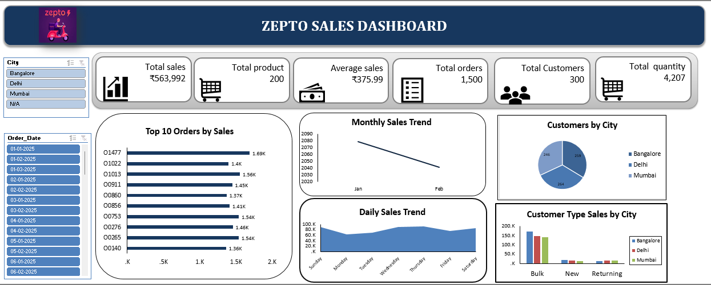

# Zepto Sales Analysis & Dashboard

## 📌 Project Overview

This project focuses on **cleaning, analyzing, and visualizing Zepto sales data using Microsoft Excel**. The raw dataset was transformed into a structured format and analyzed to generate meaningful business insights through KPIs, Pivot Tables, charts, and an interactive dashboard.

## 🎯 Objectives

* Clean and validate the raw Zepto sales data
* Identify and handle data-quality issues
* Standardize numerical, categorical, and date fields
* Analyze sales and operational performance
* Create meaningful KPIs and visualizations
* Develop an interactive Excel dashboard

## 🧹 Data Cleaning

The following data-cleaning activities were performed:

* Checked for duplicate records
* Verified Order ID uniqueness
* Identified missing values
* Standardized inconsistent categorical values
* Validated numerical fields
* Checked for invalid negative values
* Reviewed date and time fields
* Verified delivery-status categories
* Prepared the dataset for analysis and visualization

## 📊 Analysis

The project covers:

* Sales and revenue performance
* Product and category performance
* Customer segment analysis
* Payment method analysis
* Delivery performance
* Order status analysis
* KPI analysis
* Sales trends

## 📈 Dashboard

An interactive Excel dashboard was developed to present key business metrics and insights in a clear and professional format.



### Key Dashboard Areas

* Total Sales
* Total Products
* Average Sales
* Total Orders
* Total Customers
* Total Quantity
* Monthly Sales Trend
* Daily Sales Trend
* Top 10 Orders by Sales
* Customer Analysis by City

## 🛠️ Tools & Technologies

* **Microsoft Excel**
* Excel Formulas
* Pivot Tables
* Pivot Charts
* Data Cleaning
* Data Visualization
* Dashboard Development

## 📁 Project Structure

```text
zepto-sales-analysis/
│
├── README.md
├── zepto_sales_raw.xlsx
├── data-cleaning-documentation.pdf
└── zepto-sales-dashboard.png
```

## 🔍 Key Insights

* **Total Sales:** ₹563,992.25
* **Total Orders:** 1,500
* **Total Customers:** 300
* **Total Products:** 200
* **Total Quantity Sold:** 4,207
* **Average Sales per Order:** ₹375.99

## ✅ Outcome

The project transformed raw Zepto sales data into a structured and analysis-ready dataset, followed by an interactive dashboard that provides clear insights into **sales performance, product trends, customer behavior, payment patterns, and delivery operations**.

## 💡 Skills Demonstrated

**Excel | Data Cleaning | Data Analysis | Pivot Tables | Data Visualization | KPI Development | Dashboard Design | Business Intelligence**

## 📌 Conclusion

This project demonstrates the practical use of Microsoft Excel to transform raw sales data into meaningful business insights and an effective reporting dashboard.
